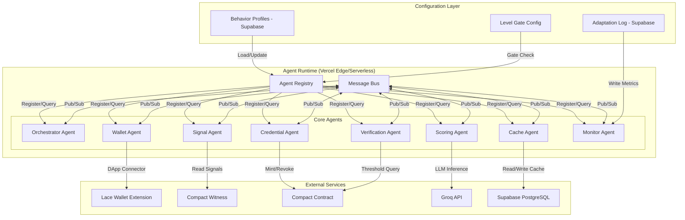
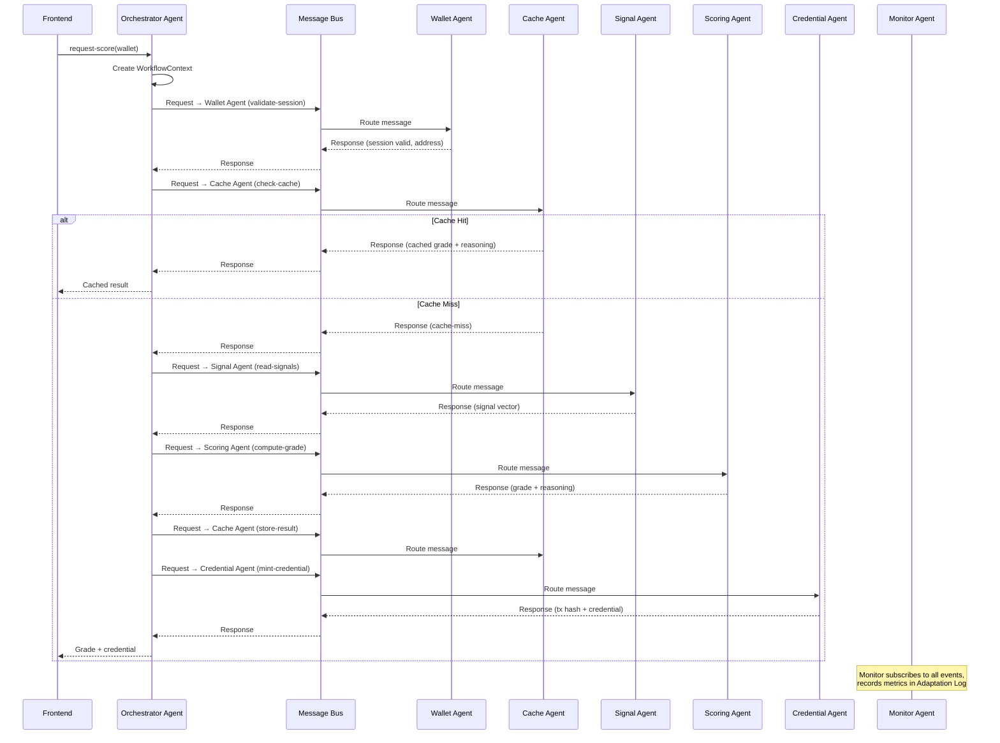
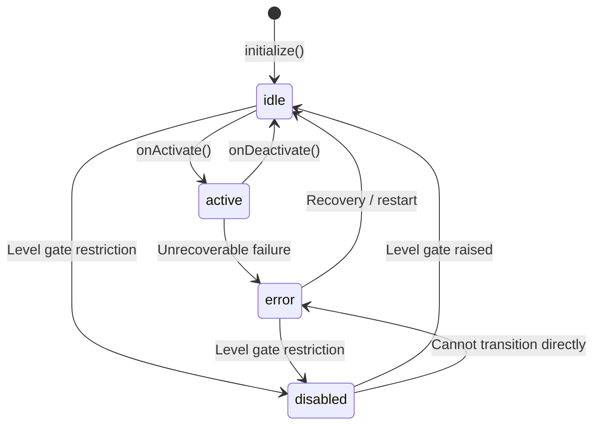

# Design Document: Adaptive Agents

## Overview

The Adaptive Agents system decomposes NightScore's credit scoring workflow into specialized, composable agents communicating through a unified message bus. This architecture replaces direct service-to-service calls with a registry-driven, message-oriented approach that supports runtime adaptability through configurable behavior profiles.

**Key design decisions:**

- **In-process message bus** — Agents run as TypeScript modules within the same Vercel serverless/edge function context. The message bus is an in-memory pub/sub system (not a separate infrastructure component like Kafka) because the deployment model is serverless and latency requirements demand sub-50ms routing.
- **Agent Registry as runtime catalog** — A singleton registry holds agent instances, validates plugin conformance, manages lifecycle states, and enforces level-gating. It is initialized on cold start and persists across warm invocations.
- **Behavior Profiles in Supabase** — JSON configuration documents stored in PostgreSQL allow runtime parameter changes without redeployment. Profiles are loaded at startup and can be hot-reloaded via polling or push notification.
- **Workflow Context as immutable pipeline state** — Each scoring workflow creates a context object that flows through the agent pipeline, accumulating intermediate results without mutation of shared state.
- **Level-gated progressive activation** — Agents activate based on the current hackathon level (1–6), allowing incremental feature delivery without dead code paths.

The system comprises 8 core agents (Orchestrator, Wallet, Signal, Scoring, Credential, Verification, Cache, Monitor) plus a plugin interface for extensibility.

## Architecture

### High-Level Agent Architecture



### Scoring Workflow Through Agents



### Agent Lifecycle State Machine



## Components and Interfaces

### 1. Agent Interface (Core Plugin Contract)

```typescript
// @nightscore/agent-types

interface Agent {
  readonly id: string;
  readonly name: string;

  // Core methods
  handleMessage(message: BusMessage): Promise<ResponseMessage | ErrorMessage>;
  getHealth(): AgentHealth;
  getCapabilities(): AgentCapability[];
  initialize(profile: BehaviorProfile): Promise<void>;

  // Lifecycle hooks
  onActivate(): Promise<void>;
  onDeactivate(): Promise<void>;
  onConfigUpdate(profile: BehaviorProfile): Promise<void>;

  // Optional
  dependencies?: string[]; // capability IDs required by this agent
}

interface AgentHealth {
  state: AgentLifecycleState;
  uptimeSeconds: number;
  requestCount: number;   // last 1 hour
  errorCount: number;     // last 1 hour
  avgResponseTimeMs: number; // last 1 hour
}

interface AgentCapability {
  topic: string;        // e.g., "scoring.compute-grade"
  description: string;
}

type AgentLifecycleState = 'idle' | 'active' | 'error' | 'disabled';
```

### 2. Message Bus Interface

```typescript
interface MessageBus {
  publish(message: BusMessage): Promise<void>;
  subscribe(topic: string, handler: MessageHandler): Subscription;
  unsubscribe(subscription: Subscription): void;
  request(message: RequestMessage, timeoutMs?: number): Promise<ResponseMessage | ErrorMessage>;
}

type MessageHandler = (message: BusMessage) => Promise<void>;

interface Subscription {
  id: string;
  topic: string;
  agentId: string;
}

// Message types
type BusMessage = RequestMessage | ResponseMessage | EventMessage | ErrorMessage;

interface MessageBase {
  id: string;                    // UUID v4
  sourceAgentId: string;
  targetAgentId: string | null;  // null = broadcast
  correlationId: string;         // links request → response
  timestamp: number;             // Unix ms
  topic: string;
}

interface RequestMessage extends MessageBase {
  type: 'request';
  payload: Record<string, unknown>;
}

interface ResponseMessage extends MessageBase {
  type: 'response';
  payload: Record<string, unknown>;
}

interface EventMessage extends MessageBase {
  type: 'event';
  payload: Record<string, unknown>;
}

interface ErrorMessage extends MessageBase {
  type: 'error';
  payload: {
    code: string;
    description: string;
    details?: Record<string, unknown>;
  };
}
```

### 3. Agent Registry Interface

```typescript
interface AgentRegistry {
  register(plugin: Agent, defaultProfile: BehaviorProfile, schema: JSONSchema): Promise<void>;
  unregister(agentId: string): Promise<void>;
  getAgent(agentId: string): Agent | undefined;
  queryAgents(filter: AgentFilter): Agent[];
  getAgentState(agentId: string): AgentLifecycleState | undefined;
  updateProfile(agentId: string, profile: BehaviorProfile): Promise<void>;
  setLevelGate(level: LevelGate): Promise<void>;
  getLevelGate(): LevelGate;
}

interface AgentFilter {
  state?: AgentLifecycleState;
  capability?: string;
  level?: LevelGate;
}

interface AgentRegistryEntry {
  agent: Agent;
  id: string;
  name: string;
  capabilities: AgentCapability[];
  state: AgentLifecycleState;
  profileRef: string;           // Profile ID in Supabase
  registeredAt: number;         // Unix ms
  profileSchema: JSONSchema;
}

type LevelGate = 1 | 2 | 3 | 4 | 5 | 6;
```

### 4. Behavior Profile Interface

```typescript
interface BehaviorProfile {
  agentId: string;
  version: number;
  parameters: Record<string, unknown>; // max 50 keys
  lastModified: number;  // Unix ms
}

interface BehaviorProfileStore {
  load(agentId: string): Promise<BehaviorProfile>;
  save(profile: BehaviorProfile): Promise<void>;
  getVersionHistory(agentId: string, limit?: number): Promise<BehaviorProfile[]>;
  rollback(agentId: string, targetVersion: number): Promise<BehaviorProfile>;
  validate(agentId: string, profile: BehaviorProfile): ValidationResult;
}

interface ValidationResult {
  valid: boolean;
  errors?: ValidationError[];
}

interface ValidationError {
  fieldPath: string;
  constraint: string;
  rejectedValue: unknown;
}
```

### 5. Workflow Context Interface

```typescript
interface WorkflowContext {
  workflowId: string;
  walletAddress: string;
  currentStep: PipelineStep;
  startTimestamp: number;
  stepResults: Map<PipelineStep, StepResult>;
  stepTimings: Map<PipelineStep, { startMs: number; endMs: number }>;
}

type PipelineStep =
  | 'validate-session'
  | 'check-cache'
  | 'read-signals'
  | 'compute-grade'
  | 'store-result'
  | 'mint-credential';

interface StepResult {
  step: PipelineStep;
  status: 'success' | 'error' | 'skipped';
  data?: Record<string, unknown>;
  error?: { code: string; description: string };
}
```

### 6. Orchestrator Agent Interface

```typescript
interface OrchestratorAgent extends Agent {
  requestScore(walletAddress: string): Promise<WorkflowResult>;
  getWorkflowStatus(workflowId: string): WorkflowContext | undefined;
  getQueueDepth(): number;
}

interface WorkflowResult {
  workflowId: string;
  status: 'success' | 'failed' | 'timeout';
  grade?: CreditGrade;
  reasoning?: SignalContribution[];
  credential?: { txHash: string; mintTimestamp: number };
  cachedResult?: boolean;
  failedStep?: PipelineStep;
  failureReason?: string;
  totalDurationMs: number;
  stepTimings: Record<PipelineStep, number>; // duration in ms per step
}
```

### 7. Adaptation Log Interface

```typescript
interface AdaptationLog {
  write(entry: LogEntry): Promise<void>;
  query(filter: LogFilter): Promise<LogEntry[]>;
  getAgentSummary(agentId: string): Promise<AgentChangeSummary>;
}

interface LogEntry {
  id: string;
  type: 'metric' | 'config-change' | 'feedback' | 'anomaly';
  agentId: string;
  timestamp: number;
  payload: Record<string, unknown>; // max 64KB
  correlationId: string;
  status?: 'complete' | 'incomplete';
}

interface LogFilter {
  agentId?: string;
  type?: LogEntry['type'];
  startTime?: number;
  endTime?: number;
  correlationId?: string;
  limit?: number; // max 500
}

interface AgentChangeSummary {
  currentParameters: Record<string, unknown>;
  changeHistory: Array<{
    version: number;
    changedAt: number;
    avgResponseTimeBefore: number;
    avgResponseTimeAfter: number;
    errorRateBefore: number;
    errorRateAfter: number;
  }>;
}
```

### 8. Monitor Agent Metrics Interface

```typescript
interface MonitorMetrics {
  getAgentMetrics(agentId: string): AgentMetricsSnapshot;
  getSystemHealth(): SystemHealthStatus;
  getAllMetrics(): Map<string, AgentMetricsSnapshot>;
}

interface AgentMetricsSnapshot {
  agentId: string;
  requestCount: number;      // last 1 hour
  avgResponseTimeMs: number; // last 1 hour
  errorCount: number;        // last 1 hour
  lifecycleState: AgentLifecycleState;
  lastUpdated: number;       // Unix ms
}

type SystemHealthStatus = 'healthy' | 'degraded' | 'unhealthy';
```

## Data Models

### Supabase Database Schema (Agent-Specific Tables)

```sql
-- Behavior Profiles table
CREATE TABLE behavior_profiles (
  id UUID PRIMARY KEY DEFAULT gen_random_uuid(),
  agent_id TEXT NOT NULL,
  version INTEGER NOT NULL DEFAULT 1,
  parameters JSONB NOT NULL,
  parameter_schema JSONB NOT NULL,       -- JSON Schema for validation
  last_modified TIMESTAMPTZ NOT NULL DEFAULT NOW(),
  is_active BOOLEAN NOT NULL DEFAULT true,
  created_at TIMESTAMPTZ NOT NULL DEFAULT NOW(),
  UNIQUE(agent_id, version)
);

-- Limit 50 keys per profile (enforced by check constraint)
ALTER TABLE behavior_profiles
  ADD CONSTRAINT max_profile_keys
  CHECK (jsonb_object_keys_count(parameters) <= 50);

-- Function to count JSONB keys
CREATE OR REPLACE FUNCTION jsonb_object_keys_count(j JSONB)
RETURNS INTEGER AS $$
  SELECT count(*)::INTEGER FROM jsonb_object_keys(j);
$$ LANGUAGE SQL IMMUTABLE;

CREATE INDEX idx_profiles_agent_active ON behavior_profiles(agent_id, is_active);
CREATE INDEX idx_profiles_agent_version ON behavior_profiles(agent_id, version DESC);

-- Adaptation Log table
CREATE TABLE adaptation_log (
  id UUID PRIMARY KEY DEFAULT gen_random_uuid(),
  entry_type TEXT NOT NULL CHECK (entry_type IN ('metric', 'config-change', 'feedback', 'anomaly')),
  agent_id TEXT NOT NULL,
  timestamp TIMESTAMPTZ NOT NULL DEFAULT NOW(),
  payload JSONB NOT NULL,
  correlation_id TEXT,
  status TEXT CHECK (status IN ('complete', 'incomplete')),
  created_at TIMESTAMPTZ NOT NULL DEFAULT NOW()
);

-- Payload size constraint (64KB)
ALTER TABLE adaptation_log
  ADD CONSTRAINT max_payload_size
  CHECK (octet_length(payload::TEXT) <= 65536);

CREATE INDEX idx_adaptation_agent ON adaptation_log(agent_id, timestamp DESC);
CREATE INDEX idx_adaptation_type ON adaptation_log(entry_type, timestamp DESC);
CREATE INDEX idx_adaptation_correlation ON adaptation_log(correlation_id);

-- Retain entries for 90+ days (archival policy)
-- Entries older than 90 days MAY be archived but MUST NOT be deleted before that

-- Level Gate configuration (single row table)
CREATE TABLE level_gate_config (
  id INTEGER PRIMARY KEY DEFAULT 1 CHECK (id = 1), -- singleton
  current_level INTEGER NOT NULL DEFAULT 1 CHECK (current_level BETWEEN 1 AND 6),
  updated_at TIMESTAMPTZ NOT NULL DEFAULT NOW()
);

INSERT INTO level_gate_config (current_level) VALUES (1);

-- Agent registry state (for persistence across cold starts)
CREATE TABLE agent_registry_state (
  agent_id TEXT PRIMARY KEY,
  display_name TEXT NOT NULL,
  capabilities JSONB NOT NULL DEFAULT '[]',
  lifecycle_state TEXT NOT NULL DEFAULT 'idle'
    CHECK (lifecycle_state IN ('idle', 'active', 'error', 'disabled')),
  profile_id UUID REFERENCES behavior_profiles(id),
  registered_at TIMESTAMPTZ NOT NULL DEFAULT NOW(),
  updated_at TIMESTAMPTZ NOT NULL DEFAULT NOW()
);

-- Row-Level Security (service role only)
ALTER TABLE behavior_profiles ENABLE ROW LEVEL SECURITY;
ALTER TABLE adaptation_log ENABLE ROW LEVEL SECURITY;
ALTER TABLE level_gate_config ENABLE ROW LEVEL SECURITY;
ALTER TABLE agent_registry_state ENABLE ROW LEVEL SECURITY;

CREATE POLICY "Service role only" ON behavior_profiles
  FOR ALL USING (auth.role() = 'service_role');
CREATE POLICY "Service role only" ON adaptation_log
  FOR ALL USING (auth.role() = 'service_role');
CREATE POLICY "Service role only" ON level_gate_config
  FOR ALL USING (auth.role() = 'service_role');
CREATE POLICY "Service role only" ON agent_registry_state
  FOR ALL USING (auth.role() = 'service_role');
```

### Message Schema (TypeScript Type Guard Validation)

```typescript
// Message validation schema for runtime type checking
const MessageSchema = {
  id: { type: 'string', format: 'uuid', required: true },
  sourceAgentId: { type: 'string', required: true },
  targetAgentId: { type: 'string', nullable: true },
  type: { type: 'enum', values: ['request', 'response', 'event', 'error'], required: true },
  correlationId: { type: 'string', required: true },
  timestamp: { type: 'number', required: true },
  topic: { type: 'string', required: true },
  payload: { type: 'object', required: true },
};
```

### Level Gate Agent Mapping

| Level | Active Agents |
|-------|--------------|
| 1 | Wallet_Agent, Credential_Agent (manual grade) |
| 2 | Level 1 + Orchestrator_Agent, Stub Scoring_Agent |
| 3 | Level 2 + Signal_Agent, Full Scoring_Agent, Cache_Agent, Monitor_Agent |
| 4+ | All agents including Verification_Agent |

### Default Behavior Profile Parameters

| Agent | Key Parameters |
|-------|---------------|
| Orchestrator | `maxConcurrentWorkflows: 10`, `queueLimit: 50`, `queueResumeAt: 40`, `workflowTimeoutMs: 120000`, `stepTimeoutMs: 30000` |
| Wallet | `connectionTimeoutMs: 30000`, `sessionStorageKey: "ns_wallet_session"` |
| Signal | `readTimeoutMs: 5000`, `defaultSignalValue: 0.5`, `minTransactionsForSignal: 3` |
| Scoring | `model: "llama-3.3-70b-versatile"`, `temperature: 0`, `apiTimeoutMs: 5000`, `dailyRateLimit: 14400` |
| Credential | `maxRetries: 3`, `backoffBaseMs: 1000`, `mintTimeoutMs: 60000` |
| Verification | `queryTimeoutMs: 3000`, `contractTimeoutMs: 2000` |
| Cache | `ttlMs: 86400000`, `maxRetries: 2`, `retryDelayMs: 500`, `connectionPoolSize: 5` |
| Monitor | `healthCheckIntervalMs: 30000`, `errorThreshold: 5`, `errorWindowMs: 600000`, `metricsUpdateIntervalMs: 10000`, `maxBufferedEntries: 500` |


## Correctness Properties

*A property is a characteristic or behavior that should hold true across all valid executions of a system — essentially, a formal statement about what the system should do. Properties serve as the bridge between human-readable specifications and machine-verifiable correctness guarantees.*

### Property 1: Agent Interface Conformance Validation

*For any* object submitted for agent registration, the Agent Registry SHALL accept the registration if and only if the object implements all required methods (handleMessage, getHealth, getCapabilities, initialize) with correct signatures. When validation fails, the rejection error SHALL list exactly the missing or non-conformant methods.

**Validates: Requirements 1.2, 1.3, 14.1, 14.7**

### Property 2: Lifecycle State-Change Event Integrity

*For any* agent lifecycle state transition (including registration, unregistration, profile update, level-gate change, error, and activation), the Agent Registry SHALL emit exactly one state-change event on the Message Bus containing the agent identifier, previous state, new state, and transition timestamp — and the event's state fields SHALL accurately reflect the agent's actual state before and after the transition.

**Validates: Requirements 1.4, 1.7, 1.8**

### Property 3: Registry Query Filtering

*For any* set of registered agents with varied lifecycle states, capability types, and Level Gate availability, and *for any* filter specifying one or more of these criteria, the Agent Registry query interface SHALL return exactly those agents matching all specified filter criteria, and an empty list when no agents match.

**Validates: Requirements 1.5**

### Property 4: Message Schema Validation

*For any* message object, the Message Bus SHALL accept the message if and only if it contains all required fields (id, sourceAgentId, targetAgentId, type, correlationId, timestamp, topic, payload) with correct types. Invalid messages SHALL be rejected with a validation error and SHALL NOT be delivered to any subscriber.

**Validates: Requirements 2.3, 2.4**

### Property 5: Topic-Based Subscription Routing

*For any* set of agent subscriptions to specific topics, and *for any* published message with a given topic, the Message Bus SHALL deliver the message to exactly those agents subscribed to that topic and to no others.

**Validates: Requirements 2.6**

### Property 6: Request Timeout Handling

*For any* Request message where no Response is received within the sender's configured timeout, the Message Bus SHALL deliver exactly one timeout Error message to the requesting agent with the correct correlation identifier linking it to the original request.

**Validates: Requirements 2.5**

### Property 7: Message Persistence for Inactive Agents

*For any* message targeted at an agent in error or disabled state, the Message Bus SHALL buffer the message and deliver it when the agent transitions to active state. Messages buffered longer than 1 hour SHALL be discarded and not delivered.

**Validates: Requirements 2.7**

### Property 8: Cache-Hit Pipeline Short-Circuit

*For any* scoring workflow where the Cache Agent returns a valid cached result (matching signal hash, non-expired TTL), the Orchestrator Agent SHALL skip the Signal Agent, Scoring Agent, and Credential Agent steps and return the cached result directly without invoking those agents.

**Validates: Requirements 3.2**

### Property 9: Pipeline Halt on Agent Failure

*For any* scoring workflow where any agent in the pipeline returns an Error message or times out, the Orchestrator Agent SHALL halt the pipeline at the failed step, record the failure in the Workflow Context, and return a workflow-failed response identifying the failed step and reason.

**Validates: Requirements 3.3, 3.8**

### Property 10: Workflow Context Accumulation

*For any* sequence of pipeline steps executed by the Orchestrator, the Workflow Context SHALL accurately contain: the workflow identifier, wallet address, current step, intermediate results from all completed steps, start timestamp, and step-level timing for each completed step.

**Validates: Requirements 3.4, 3.5**

### Property 11: Concurrency and Backpressure

*For any* number of concurrent workflow requests, the Orchestrator Agent SHALL process at most 10 simultaneously, queue excess requests in FIFO order, reject new requests when the queue exceeds 50 pending requests, and resume accepting requests when the queue drops below 40 pending requests.

**Validates: Requirements 3.6, 3.7**

### Property 12: Signal Normalization

*For any* raw wallet signal input, the Signal Agent SHALL produce a normalized signal vector containing exactly 6 values each in the closed interval [0.0, 1.0]. For any signal where insufficient on-chain data exists (fewer than the threshold in the Behavior Profile), the value SHALL be exactly 0.5 with an estimated flag set to true.

**Validates: Requirements 5.1, 5.2, 5.4**

### Property 13: Scoring Output Structure and Validation

*For any* valid normalized signal vector (6 values in [0.0, 1.0]), the Scoring Agent SHALL return a Credit Grade from {AAA, AA, A, BBB, BB, C} and a reasoning breakdown of exactly 6 entries — one per signal — each with a direction ('positive' or 'negative') and a weight in [0.0, 1.0]. For any invalid vector (out-of-range values or missing signals), the Scoring Agent SHALL reject with a validation error specifying invalid signals.

**Validates: Requirements 6.1, 6.6**

### Property 14: Scoring Determinism

*For any* normalized signal vector, invoking the Scoring Agent multiple times with the same input and the same Behavior Profile SHALL always produce the same Credit Grade and the same reasoning breakdown.

**Validates: Requirements 6.5**

### Property 15: Credential Request Validation

*For any* mint-credential request missing the wallet address, Credit Grade, or signal vector hash, or containing a Credit Grade not in {AAA, AA, A, BBB, BB, C}, the Credential Agent SHALL reject the request with a validation error listing the invalid fields without invoking the Compact Contract.

**Validates: Requirements 7.7**

### Property 16: Credential Revocation Before Re-Mint

*For any* wallet address that already holds an active ZK credential, minting a new credential SHALL first revoke the existing one. If revocation fails after exhausting the configured retry count, the mint SHALL be aborted without creating a new credential.

**Validates: Requirements 7.2**

### Property 17: Threshold Comparison Correctness

*For any* stored Credit Grade G and requested minimum grade M from {AAA, AA, A, BBB, BB, C}, the Verification Agent SHALL return true if and only if the numeric encoding of G (AAA=5, AA=4, A=3, BBB=2, BB=1, C=0) is greater than or equal to the numeric encoding of M.

**Validates: Requirements 8.1, 8.2**

### Property 18: Verification Input Validation

*For any* threshold query where the minimum grade is not in {AAA, AA, A, BBB, BB, C}, the Verification Agent SHALL reject with an invalid-grade error. For any query where the wallet address is empty or malformed, it SHALL reject with an invalid-address error. Neither rejection SHALL invoke the Compact Contract.

**Validates: Requirements 8.5, 8.6**

### Property 19: Verification Privacy

*For any* threshold verification query and response, the response SHALL contain only the boolean result (true/false) or an error — never the actual Credit Grade value, wallet signals, or signal vector. The verification.queried event SHALL contain only the timestamp and querying address, never the result or queried wallet address.

**Validates: Requirements 8.3, 8.8**

### Property 20: Cache Hit/Miss Correctness

*For any* check-cache request with wallet address W and signal hash H, the Cache Agent SHALL return the cached grade and reasoning if an entry exists with matching hash and computation timestamp less than the configured TTL. Otherwise it SHALL return a cache-miss response containing W and H.

**Validates: Requirements 9.1, 9.2**

### Property 21: Cache Graceful Degradation

*For any* cache read or write failure (after exhausting retries from the Behavior Profile), the Cache Agent SHALL return a cache-unavailable response (not an error that halts the pipeline) and publish a "cache.failure" event.

**Validates: Requirements 9.5**

### Property 22: Privacy in Events and Logs

*For any* event published on the Message Bus or entry written to the Adaptation Log during scoring operations, the payload SHALL NOT contain raw wallet signal values, normalized signal vector values, or Credit Grade values — only operation status, timestamps, agent identifiers, hashes, and performance metrics.

**Validates: Requirements 5.5, 7.3, 10.6**

### Property 23: System Health Status Determination

*For any* combination of agent lifecycle states and active alerts, the Monitor Agent SHALL compute system health as: "healthy" when all active agents are in active state with no unresolved alerts; "degraded" when at least one agent has a degraded alert or is in error state but the Orchestrator remains active; "unhealthy" when the Orchestrator is in error/unresponsive state or more than half of active agents are in error state.

**Validates: Requirements 10.5**

### Property 24: Error Threshold Alerting

*For any* agent whose error count exceeds the configured threshold (default 5) within the configured time window (default 10 minutes), the Monitor Agent SHALL publish exactly one "alert.agent-degraded" event identifying the agent, error count, and time window.

**Validates: Requirements 10.3**

### Property 25: Behavior Profile Version Retention

*For any* sequence of Behavior Profile updates to a single agent, the system SHALL retain the previous 10 versions. A rollback to any retained version SHALL create a new version entry with the restored parameters.

**Validates: Requirements 11.3**

### Property 26: Profile Schema Validation

*For any* Behavior Profile update, the system SHALL validate the update against the agent-specific JSON schema before application. Invalid updates SHALL be rejected with errors specifying: field paths that failed, constraints violated, and rejected values.

**Validates: Requirements 11.5**

### Property 27: Config Regression Detection

*For any* Behavior Profile change followed by an error rate exceeding the degraded threshold within 5 minutes of application, the Monitor Agent SHALL publish an "alert.config-regression" event containing the agent identifier, change details, observed error rate, and a rollback recommendation.

**Validates: Requirements 11.6**

### Property 28: Failed Config Apply Retains Previous State

*For any* agent that receives a valid Behavior Profile update but fails to apply it (internal error or constraint conflict), the agent SHALL retain its previous parameters, transition to error state, and publish a "config.apply-failed" event.

**Validates: Requirements 11.7**

### Property 29: Concurrent Profile Update Resolution

*For any* two or more Behavior Profile updates submitted concurrently for the same agent, the system SHALL apply only the update with the latest timestamp, discard earlier updates, and return a conflict indication to discarded update submitters.

**Validates: Requirements 11.8**

### Property 30: Adaptation Log Query Filtering

*For any* query over the Adaptation Log specifying agent, entry type, time range, and/or correlation identifier, the system SHALL return at most 500 matching entries ordered by timestamp descending. Results SHALL contain only entries matching all specified filter criteria.

**Validates: Requirements 12.4**

### Property 31: Level-Gated Agent Activation

*For any* Level Gate value L from 1 to 6, the Agent Registry SHALL activate exactly the agents specified for that level: Level 1 = {Wallet, Credential}; Level 2 = Level 1 + {Orchestrator, Stub Scoring}; Level 3 = Level 2 + {Signal, Full Scoring, Cache, Monitor}; Level 4+ = All agents including Verification. All other agents SHALL be in disabled state.

**Validates: Requirements 13.2, 13.3, 13.4, 13.5**

### Property 32: Disabled Agent Message Rejection

*For any* message sent to an agent in the disabled state (due to Level Gate restriction), the agent SHALL reject the message with a "not-available-at-current-level" error without processing it.

**Validates: Requirements 13.7**

### Property 33: Dependency Verification on Activation

*For any* agent with declared dependencies, the Agent Registry SHALL activate the agent only if every declared capability is provided by at least one agent currently in active or idle state. If a dependency becomes unsatisfiable (provider transitions to error/disabled), the dependent agent SHALL transition to idle.

**Validates: Requirements 14.6, 14.9**

### Property 34: Capability Override Routing

*For any* two registered agents with overlapping capabilities, messages for overlapping topics SHALL be routed to the most recently registered agent, and a "registry.capability-override" event SHALL be emitted identifying the overridden agent and affected topics.

**Validates: Requirements 14.8**

## Error Handling

### Error Categories by Agent

| Agent | Error Code | Cause | Recovery |
|-------|-----------|-------|----------|
| Wallet | `WALLET_CONNECTION_FAILED` | Lace timeout or rejection | Emit event, return to idle |
| Wallet | `WALLET_SESSION_EXPIRED` | Session no longer valid | Clear session, require reconnect |
| Signal | `SIGNAL_READ_FAILED` | Compact Witness unreachable | Abort, return error with partial read status |
| Signal | `SIGNAL_INVALID_WALLET` | No active wallet session | Reject without invoking witness |
| Scoring | `SCORING_UNAVAILABLE` | Groq API timeout (5s) | Return error, no default grade |
| Scoring | `SCORING_RATE_LIMITED` | 14,400/day limit reached | Return error, publish rate-limited event |
| Scoring | `SCORING_PARSE_ERROR` | Groq response unparseable | Discard, return parse error, publish event |
| Scoring | `SCORING_INVALID_INPUT` | Signal vector invalid | Reject with specific field errors |
| Credential | `MINTING_FAILED` | Contract interaction failure | Retry 3x with exponential backoff |
| Credential | `MINTING_TIMEOUT` | TX not confirmed in 60s | Mark timed out, return error |
| Credential | `REVOCATION_FAILED` | Cannot revoke existing credential | Abort entire mint workflow |
| Credential | `CREDENTIAL_INVALID_REQUEST` | Missing/invalid fields | Reject before contract call |
| Verification | `INVALID_GRADE` | Grade not in valid set | Reject query |
| Verification | `INVALID_ADDRESS` | Empty or malformed address | Reject without contract call |
| Verification | `CONTRACT_UNAVAILABLE` | Contract unreachable in 2s | Temporary-unavailable response |
| Verification | `NO_CREDENTIAL` | Wallet has no active credential | Return "no credential found" |
| Cache | `CACHE_UNAVAILABLE` | Supabase unreachable after retries | Non-halting response, publish event |
| Cache | `CACHE_VALIDATION_ERROR` | Missing required fields | Reject with field list |
| Orchestrator | `WORKFLOW_TIMEOUT` | 120s exceeded | Halt pipeline, return failure |
| Orchestrator | `WORKFLOW_STEP_FAILED` | Agent error or 30s step timeout | Halt at step, return failure details |
| Orchestrator | `SYSTEM_BUSY` | Queue > 50 | Reject until queue < 40 |
| Monitor | `LOG_UNAVAILABLE` | Adaptation Log unreachable | Buffer in memory (max 500), publish event |
| Registry | `REGISTRATION_INVALID` | Plugin missing interface methods | Reject, return missing methods |
| Registry | `DEPENDENCY_UNAVAILABLE` | Required capability not available | Transition dependent to idle |
| Bus | `MESSAGE_VALIDATION_FAILED` | Schema violation | Reject, return validation error |
| Bus | `MESSAGE_TIMEOUT` | No response within timeout | Deliver timeout error to sender |

### Error Response Format (Bus-Level)

```typescript
interface AgentErrorResponse {
  type: 'error';
  payload: {
    code: string;           // Machine-readable error code
    description: string;    // Human-readable description
    retryable: boolean;     // Whether the caller should retry
    retryAfterMs?: number;  // Suggested retry delay
    details?: {
      failedStep?: PipelineStep;
      missingFields?: string[];
      invalidValues?: Record<string, unknown>;
    };
  };
}
```

### Retry Policies (Per Agent Behavior Profile)

| Agent | Operation | Max Retries | Backoff Strategy | Timeout |
|-------|-----------|-------------|-----------------|---------|
| Credential | Mint TX | 3 | Exponential (1s, 2s, 4s) | 60s per attempt |
| Credential | Revoke TX | 3 (from profile) | Exponential (1s, 2s, 4s) | 60s per attempt |
| Cache | Read/Write | 2 | Fixed 500ms | 3s per attempt |
| Scoring | Groq API | 0 (fail immediately) | N/A | 5s |
| Message Bus | Delivery to active agent | 0 | N/A | Per sender's profile (default 30s) |
| Orchestrator | Pipeline step | 0 (halt on failure) | N/A | 30s per step |

### Graceful Degradation Strategy

- **Cache Agent down**: Orchestrator continues without cache — every request runs full pipeline. Logged as degraded.
- **Monitor Agent down**: System continues operating without metrics/alerting. Critical operations unaffected.
- **Scoring Agent rate-limited**: Cached results still served. New requests receive rate-limit-exceeded error.
- **Single agent in error**: Monitor alerts, Orchestrator routes around if possible. System status = degraded.
- **Orchestrator down**: No new workflows processed. Verification queries still work (independent of Orchestrator). System status = unhealthy.

## Testing Strategy

### Testing Approach

The Adaptive Agents system contains extensive pure logic (message routing, lifecycle state machines, validation, level-gating, threshold comparison, cache logic, profile validation, and orchestration) that is well-suited to property-based testing. The testing strategy uses a dual approach:

- **Property-based tests** verify universal correctness properties across all valid inputs using randomized generation
- **Unit tests** cover specific examples, integration points, and error scenarios
- **Integration tests** verify end-to-end agent pipeline behavior and external service interactions

### Property-Based Testing

**Library**: [fast-check](https://github.com/dubzzz/fast-check) (TypeScript)

**Configuration**: Minimum 100 iterations per property test.

**Tag format**: `Feature: adaptive-agents, Property {number}: {property_text}`

| Property | Test Target | Generator Strategy |
|----------|------------|-------------------|
| P1: Interface Conformance | `AgentRegistry.register()` | Objects with random subsets of required methods |
| P2: State-Change Events | `AgentRegistry` lifecycle methods | Random state transitions (register, unregister, update, level-gate) |
| P3: Registry Filtering | `AgentRegistry.queryAgents()` | Random agent sets × random filter combinations |
| P4: Message Validation | `MessageBus.publish()` | Random message objects with varied field presence/types |
| P5: Topic Routing | `MessageBus.publish()` + subscriptions | Random subscription sets × random messages |
| P6: Request Timeout | `MessageBus.request()` | Random timeouts with no response |
| P7: Message Persistence | `MessageBus` buffering | Random messages to inactive agents × state transitions |
| P8: Cache Short-Circuit | `OrchestratorAgent.requestScore()` | Random cache hit scenarios |
| P9: Pipeline Halt | `OrchestratorAgent.requestScore()` | Random failure injection at each step |
| P10: Workflow Context | `OrchestratorAgent` | Random step result sequences |
| P11: Concurrency | `OrchestratorAgent` queue management | Random request arrival patterns |
| P12: Signal Normalization | `SignalAgent.handleMessage()` | Random raw signals × availability patterns |
| P13: Scoring Output | `ScoringAgent.handleMessage()` | Random valid/invalid signal vectors |
| P14: Scoring Determinism | `ScoringAgent.handleMessage()` | Random vectors run multiple times |
| P15: Credential Validation | `CredentialAgent.handleMessage()` | Random request objects with varied field presence |
| P16: Revocation Logic | `CredentialAgent` mint flow | Random credential states (existing/none) × failure patterns |
| P17: Threshold Comparison | `VerificationAgent` threshold logic | All 36 grade pair combinations + random extras |
| P18: Verification Input | `VerificationAgent.handleMessage()` | Random invalid grades + malformed addresses |
| P19: Verification Privacy | `VerificationAgent` response inspection | Random queries, inspect response/event fields |
| P20: Cache Hit/Miss | `CacheAgent.handleMessage()` | Random cache states × TTL × hash combinations |
| P21: Cache Degradation | `CacheAgent` failure handling | Random failure patterns after retry exhaustion |
| P22: Event/Log Privacy | All agents' published events | Random scoring payloads, inspect event/log fields |
| P23: System Health | `MonitorAgent.getSystemHealth()` | Random agent state + alert combinations |
| P24: Error Alerting | `MonitorAgent` threshold detection | Random error sequences within time windows |
| P25: Profile Versioning | `BehaviorProfileStore` | Random update sequences, verify retention |
| P26: Schema Validation | `BehaviorProfileStore.validate()` | Random profile objects vs. schemas |
| P27: Config Regression | `MonitorAgent` regression detection | Random config changes × error rate patterns |
| P28: Failed Config | Agent `onConfigUpdate()` | Random failing config applications |
| P29: Concurrent Updates | `BehaviorProfileStore.save()` | Pairs of concurrent updates with varied timestamps |
| P30: Log Query | `AdaptationLog.query()` | Random log entries × query filters |
| P31: Level Gating | `AgentRegistry.setLevelGate()` | All 6 level values, verify agent activation sets |
| P32: Disabled Rejection | Agent `handleMessage()` in disabled state | Random messages to disabled agents |
| P33: Dependencies | `AgentRegistry` activation with dependencies | Random dependency graphs × provider states |
| P34: Capability Override | `AgentRegistry` + `MessageBus` routing | Random registration order × overlapping capabilities |

### Unit Testing (Example-Based)

**Library**: Vitest

Focus areas:
- Orchestrator pipeline sequence (happy path end-to-end)
- Individual agent error handling scenarios (timeout, rate limit, parse error)
- Wallet Agent connect/disconnect/session flows
- Credential Agent retry timing (verify backoff values)
- Monitor Agent health check interval behavior
- Behavior Profile hot-reload mechanics
- Adaptation Log baseline/comparison snapshot timing

### Integration Testing

**Library**: Vitest + Supabase local dev + mocked external services

Focus areas:
- Full scoring workflow through all agents (Wallet → Cache → Signal → Scoring → Credential)
- Behavior Profile persistence and retrieval from Supabase
- Adaptation Log write and query over PostgreSQL
- Level Gate changes triggering agent activation/deactivation
- Message Bus performance under concurrent load (< 50ms routing)
- Agent Registry cold start initialization (< 30 seconds)

### Test Organization

```
src/
├── agents/
│   ├── __tests__/
│   │   ├── orchestrator.test.ts        # Unit + example tests
│   │   ├── orchestrator.property.ts    # Property tests (P8-P11)
│   │   ├── wallet.test.ts
│   │   ├── signal.test.ts
│   │   ├── signal.property.ts          # Property tests (P12)
│   │   ├── scoring.test.ts
│   │   ├── scoring.property.ts         # Property tests (P13, P14)
│   │   ├── credential.test.ts
│   │   ├── credential.property.ts      # Property tests (P15, P16)
│   │   ├── verification.test.ts
│   │   ├── verification.property.ts    # Property tests (P17-P19)
│   │   ├── cache.test.ts
│   │   ├── cache.property.ts           # Property tests (P20, P21)
│   │   └── monitor.test.ts
│   │       └── monitor.property.ts     # Property tests (P23, P24, P27)
│   └── ...
├── bus/
│   └── __tests__/
│       ├── message-bus.test.ts
│       └── message-bus.property.ts     # Property tests (P4-P7)
├── registry/
│   └── __tests__/
│       ├── agent-registry.test.ts
│       └── agent-registry.property.ts  # Property tests (P1-P3, P31-P34)
├── config/
│   └── __tests__/
│       ├── behavior-profile.test.ts
│       └── behavior-profile.property.ts # Property tests (P25, P26, P28, P29)
├── log/
│   └── __tests__/
│       └── adaptation-log.property.ts   # Property tests (P30)
└── privacy/
    └── __tests__/
        └── privacy.property.ts          # Property tests (P22)
```

### Test Coverage Targets

| Layer | Target | Notes |
|-------|--------|-------|
| Message Bus (routing, validation) | 95%+ | Core infrastructure, property tests provide comprehensive coverage |
| Agent Registry (lifecycle, filtering) | 95%+ | Critical state management, exhaustively tested |
| Orchestrator (pipeline, concurrency) | 90%+ | Complex state, property + unit tests |
| Individual Agents (Scoring, Signal, etc.) | 85%+ | Validation and pure logic paths |
| Behavior Profile (versioning, validation) | 90%+ | Configuration correctness critical |
| Adaptation Log (storage, querying) | 85%+ | Data integrity important |
| Integration (full workflows) | 1+ happy path per pipeline | End-to-end verification |

### CI/CD Integration

```
┌─────────────────────┐
│  Lint + Type Check   │
│  (ESLint + TSC)      │
└──────────┬──────────┘
           │
┌──────────▼──────────┐
│  Property Tests      │
│  (fast-check, 100+  │
│   iterations each)   │
└──────────┬──────────┘
           │
┌──────────▼──────────┐
│  Unit Tests          │
│  (Vitest)            │
└──────────┬──────────┘
           │
┌──────────▼──────────┐
│  Integration Tests   │
│  (Supabase local)    │
└──────────┬──────────┘
           │
┌──────────▼──────────┐
│  Build + Deploy      │
│  (Vercel)            │
└──────────────────────┘
```
