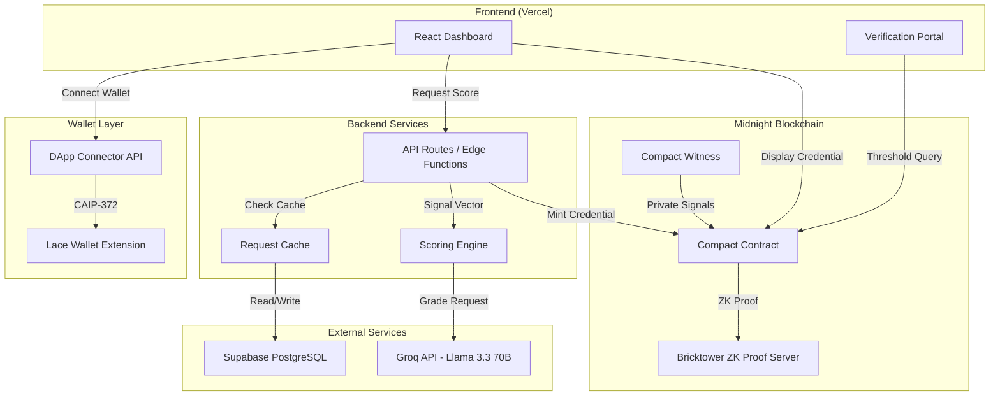
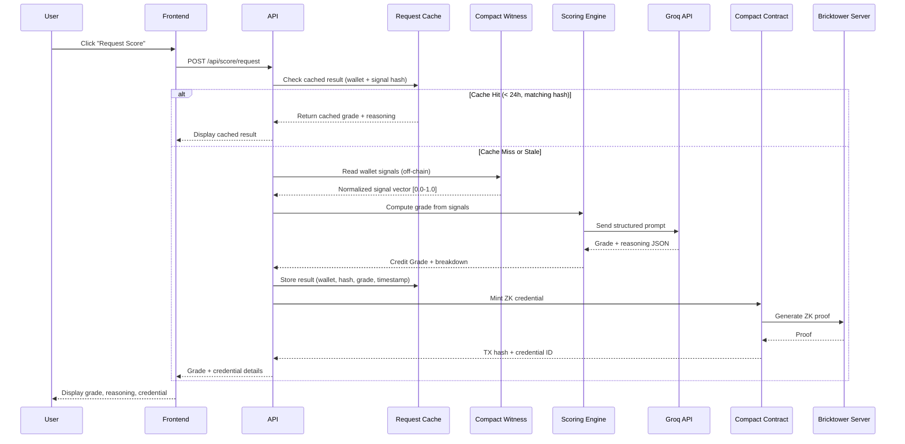
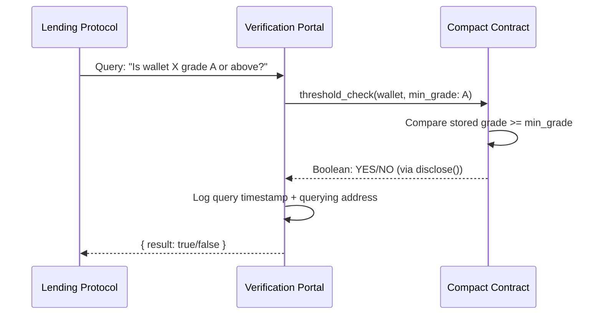

# Design Document: NIGHTSCORE

## Overview

NIGHTSCORE is a privacy-preserving on-chain credit scoring system built on the Midnight blockchain. It combines AI-driven credit assessment (via Groq's Llama 3.3 70B model) with Zero-Knowledge proofs to enable DeFi users to obtain verifiable credit scores without exposing underlying financial data.

The system follows a three-tier architecture:

1. **Frontend (React on Vercel)** — User dashboard, wallet connection, score requests, and verification portal
2. **Backend Services (Serverless/Edge Functions)** — Orchestration layer connecting wallet signals, AI scoring, caching, and on-chain operations
3. **On-Chain Layer (Midnight Compact Contracts)** — ZK credential minting, threshold verification, and private state management

Key design decisions:
- **Compact witness functions** handle private wallet signal reading off-chain while proving computation integrity via ZK proofs
- **Groq API** provides fast inference (~2s) for credit grade computation with structured JSON output
- **Supabase PostgreSQL** serves as the request cache with row-level security (RLS)
- **Bricktower community ZK proof server** handles proof generation for testnet deployments
- **Soulbound NFTs** represent credit credentials — non-transferable and queryable only through threshold verification

## Architecture

### High-Level System Architecture



### Scoring Workflow Sequence



### Threshold Verification Flow



## Components and Interfaces

### 1. Frontend Components (React)

| Component | Responsibility |
|-----------|---------------|
| `WalletConnector` | Manages Lace wallet connection via DApp Connector API (CAIP-372) |
| `Dashboard` | Displays credit grade, credential status, reasoning breakdown |
| `ScoreRequestFlow` | Orchestrates multi-step scoring with progress indicators |
| `VerificationPortal` | Public interface for threshold queries |
| `GradeBadge` | Color-coded visual grade indicator (green/yellow/red) |
| `ErrorBoundary` | Handles connection failures, timeouts, and retries |

### 2. Backend API (Vercel Edge Functions)

| Endpoint | Method | Purpose |
|----------|--------|---------|
| `/api/wallet/session` | POST | Validate wallet connection, create session |
| `/api/score/request` | POST | Initiate scoring workflow |
| `/api/score/status/:id` | GET | Poll scoring workflow status |
| `/api/verify/threshold` | POST | Submit threshold verification query |
| `/api/cache/invalidate` | POST | Force cache invalidation (admin) |

### 3. Scoring Engine Interface

```typescript
interface ScoringEngine {
  computeGrade(signals: NormalizedSignalVector): Promise<ScoringResult>;
  validateSignals(signals: NormalizedSignalVector): ValidationResult;
}

interface NormalizedSignalVector {
  walletAge: number;          // 0.0 - 1.0
  txFrequency: number;        // 0.0 - 1.0
  defiInteractions: number;   // 0.0 - 1.0
  repaymentHistory: number;   // 0.0 - 1.0
  assetDiversity: number;     // 0.0 - 1.0
  liquidationHistory: number; // 0.0 - 1.0
}

interface ScoringResult {
  grade: CreditGrade;
  reasoning: SignalContribution[];
  proofHash: string;
  computedAt: number; // unix timestamp
}

interface SignalContribution {
  signal: keyof NormalizedSignalVector;
  value: number;
  direction: 'positive' | 'negative';
  weight: number; // relative weight 0.0 - 1.0
}

type CreditGrade = 'AAA' | 'AA' | 'A' | 'BBB' | 'BB' | 'C';
```

### 4. Compact Contract Interface (Pseudocode)

```compact
// NIGHTSCORE Compact Contract

ledger {
  credentials: Map<Address, Credential>;
}

struct Credential {
  grade: Unsigned Integer<3>;   // 0=C, 1=BB, 2=BBB, 3=A, 4=AA, 5=AAA
  proofHash: Bytes<32>;
  mintTimestamp: Unsigned Integer<64>;
  isActive: Boolean;
}

// Witness: provides private signal data off-chain
witness readWalletSignals(wallet: Address): SignalVector;

// Circuit: mint a ZK credential
circuit mintCredential(grade: Unsigned Integer<3>, proofHash: Bytes<32>) {
  // Verify caller is authorized
  // Revoke existing credential if present
  // Store new credential with grade + proofHash
  // Emit mint event
}

// Circuit: threshold verification using disclose()
circuit thresholdCheck(wallet: Address, minGrade: Unsigned Integer<3>): Boolean {
  const cred = ledger.credentials[wallet];
  assert(cred.isActive);
  disclose(cred.grade >= minGrade);  // Only reveals boolean
}
```

### 5. Request Cache Interface

```typescript
interface RequestCache {
  get(walletAddress: string, signalHash: string): Promise<CachedResult | null>;
  set(entry: CacheEntry): Promise<void>;
  invalidate(walletAddress: string): Promise<void>;
}

interface CacheEntry {
  walletAddress: string;
  signalVectorHash: string;  // SHA-256 of normalized signal vector
  grade: CreditGrade;
  reasoning: SignalContribution[];
  computedAt: Date;
  expiresAt: Date;           // computedAt + 24 hours
}

interface CachedResult {
  grade: CreditGrade;
  reasoning: SignalContribution[];
  computedAt: Date;
  isCached: true;
}
```

### 6. Wallet Integration Interface

```typescript
interface WalletService {
  connect(): Promise<WalletConnection>;
  disconnect(): Promise<void>;
  getAddress(): string | null;
  isConnected(): boolean;
  signTransaction(tx: MidnightTransaction): Promise<SignedTransaction>;
}

interface WalletConnection {
  address: string;
  truncatedAddress: string; // first 6 + last 4 chars
  connectedAt: Date;
}
```

## Data Models

### Credit Grade Ordering

```
AAA (5) > AA (4) > A (3) > BBB (2) > BB (1) > C (0)
```

The grade is stored on-chain as an unsigned 3-bit integer for efficient comparison in ZK circuits.

### Supabase Database Schema

```sql
-- Request cache table
CREATE TABLE scoring_cache (
  id UUID PRIMARY KEY DEFAULT gen_random_uuid(),
  wallet_address TEXT NOT NULL,
  signal_vector_hash TEXT NOT NULL,  -- SHA-256 hex
  grade TEXT NOT NULL CHECK (grade IN ('AAA', 'AA', 'A', 'BBB', 'BB', 'C')),
  reasoning JSONB NOT NULL,
  computed_at TIMESTAMPTZ NOT NULL DEFAULT NOW(),
  expires_at TIMESTAMPTZ NOT NULL DEFAULT (NOW() + INTERVAL '24 hours'),
  created_at TIMESTAMPTZ NOT NULL DEFAULT NOW()
);

-- Index for cache lookups
CREATE INDEX idx_cache_wallet_hash ON scoring_cache(wallet_address, signal_vector_hash);
CREATE INDEX idx_cache_expiry ON scoring_cache(expires_at);

-- Row-Level Security
ALTER TABLE scoring_cache ENABLE ROW LEVEL SECURITY;

CREATE POLICY "Service role only" ON scoring_cache
  FOR ALL USING (auth.role() = 'service_role');

-- Verification audit log
CREATE TABLE verification_log (
  id UUID PRIMARY KEY DEFAULT gen_random_uuid(),
  queried_wallet TEXT NOT NULL,
  querying_address TEXT NOT NULL,
  query_timestamp TIMESTAMPTZ NOT NULL DEFAULT NOW(),
  min_grade_requested TEXT NOT NULL,
  -- Note: result is NOT stored per privacy requirements
  created_at TIMESTAMPTZ NOT NULL DEFAULT NOW()
);

CREATE INDEX idx_verification_log_timestamp ON verification_log(query_timestamp);

-- Retain logs for 90+ days (enforce via cron or Supabase scheduled function)
-- Logs older than 90 days MAY be archived but MUST NOT be deleted before that

-- Rate limit tracking
CREATE TABLE rate_limit_tracker (
  id UUID PRIMARY KEY DEFAULT gen_random_uuid(),
  date DATE NOT NULL DEFAULT CURRENT_DATE,
  request_count INTEGER NOT NULL DEFAULT 0,
  UNIQUE(date)
);
```

### On-Chain State Model (Compact Ledger)

| Field | Type | Description |
|-------|------|-------------|
| `credentials` | `Map<Address, Credential>` | Maps wallet addresses to their credential |
| `owner` | `Address` | Contract deployer/admin address |

**Credential struct:**

| Field | Type | Description |
|-------|------|-------------|
| `grade` | `Uint<3>` | Encoded grade (0-5) |
| `proofHash` | `Bytes<32>` | SHA-256(signal_vector ‖ grade) |
| `mintTimestamp` | `Uint<64>` | Block timestamp at mint |
| `isActive` | `Boolean` | Whether credential is valid |

### Scoring Engine Prompt Structure

```typescript
interface GroqScoringPrompt {
  model: 'llama-3.3-70b-versatile';
  messages: [
    {
      role: 'system';
      content: string; // Deterministic scoring rubric
    },
    {
      role: 'user';
      content: string; // JSON signal vector
    }
  ];
  response_format: { type: 'json_object' };
  temperature: 0;      // Deterministic output
  max_tokens: 1024;
}

// Expected response structure
interface GroqScoringResponse {
  grade: CreditGrade;
  reasoning: {
    signal: string;
    contribution: 'positive' | 'negative';
    weight: number;
    explanation: string;
  }[];
  confidence: number;
}
```

### Frontend State Model

```typescript
interface AppState {
  wallet: {
    isConnected: boolean;
    address: string | null;
    truncatedAddress: string | null;
  };
  scoring: {
    status: 'idle' | 'reading_signals' | 'computing_grade' | 'minting' | 'complete' | 'error';
    currentGrade: CreditGrade | null;
    reasoning: SignalContribution[] | null;
    error: string | null;
  };
  credential: {
    status: 'not_minted' | 'minting_in_progress' | 'minted' | 'expired';
    txHash: string | null;
    mintTimestamp: Date | null;
  };
}
```


## Correctness Properties

*A property is a characteristic or behavior that should hold true across all valid executions of a system — essentially, a formal statement about what the system should do. Properties serve as the bridge between human-readable specifications and machine-verifiable correctness guarantees.*

### Property 1: Address Truncation

*For any* wallet address string of 10 or more characters, the truncation function SHALL produce a string consisting of the first 6 characters, an ellipsis separator, and the last 4 characters of the original address.

**Validates: Requirements 1.2**

### Property 2: Session State Clearing

*For any* application state with an active wallet session (containing address, credentials, scoring data), disconnecting the wallet SHALL produce a state where all session fields are reset to their default unauthenticated values.

**Validates: Requirements 1.4**

### Property 3: Default Signal Assignment

*For any* subset of unavailable wallet signals (due to fewer than 3 relevant transactions), the signal normalization step SHALL assign exactly 0.5 to each unavailable signal and flag it as estimated, while leaving available signals at their computed values.

**Validates: Requirements 2.3**

### Property 4: Signal Normalization Range

*For any* raw wallet signal input values, the normalization function SHALL produce output values strictly within the closed interval [0.0, 1.0] for every signal in the vector.

**Validates: Requirements 2.4**

### Property 5: Scoring Output Structure

*For any* valid normalized signal vector, the Scoring Engine SHALL produce a result containing: (a) a grade from the set {AAA, AA, A, BBB, BB, C}, and (b) a reasoning array with exactly 6 entries, one per signal, each containing a valid direction ('positive' or 'negative') and a weight in [0.0, 1.0].

**Validates: Requirements 3.1, 3.2**

### Property 6: Scoring Determinism

*For any* normalized signal vector, invoking the Scoring Engine multiple times with the same input SHALL always produce the same Credit Grade and the same reasoning breakdown.

**Validates: Requirements 3.4**

### Property 7: Signal Vector Validation

*For any* signal vector that is missing one or more required signals, or contains any value outside the [0.0, 1.0] range, the validation function SHALL reject the input and return an error specifying which signals are invalid.

**Validates: Requirements 3.7**

### Property 8: Cache Hit/Miss Correctness

*For any* scoring request with wallet address W and signal hash H: if the cache contains an entry for W with matching hash H and a computation timestamp less than 24 hours old, the system SHALL return the cached result; otherwise, the system SHALL invoke the full scoring workflow.

**Validates: Requirements 3.6, 7.2, 7.3**

### Property 9: Proof Hash Determinism

*For any* normalized signal vector and credit grade pair, computing the proof hash (SHA-256 of signal vector concatenated with grade) SHALL always produce the same 32-byte hash value.

**Validates: Requirements 4.3**

### Property 10: Credential Revocation on Re-Mint

*For any* wallet address that already holds an active ZK credential, minting a new credential SHALL result in exactly one active credential for that wallet (the new one), with the previous credential marked as inactive.

**Validates: Requirements 4.4**

### Property 11: Threshold Comparison Correctness

*For any* stored credit grade G and query minimum grade M, the threshold check SHALL return true if and only if the numeric encoding of G is greater than or equal to the numeric encoding of M, using the ordering C(0) < BB(1) < BBB(2) < A(3) < AA(4) < AAA(5).

**Validates: Requirements 5.1, 5.2**

### Property 12: Invalid Grade Rejection

*For any* threshold query submitted with a grade value not in the set {AAA, AA, A, BBB, BB, C}, the contract SHALL reject the query and return an invalid-grade error.

**Validates: Requirements 5.6**

### Property 13: Grade-to-Color Mapping

*For any* credit grade, the badge color mapping SHALL produce: green for grades in {AAA, AA, A}, yellow for grade BBB, and red for grades in {BB, C}.

**Validates: Requirements 6.6**

### Property 14: Cache Stores Only Hashed Signals

*For any* cache write operation given a normalized signal vector, the stored entry SHALL contain the SHA-256 hash of the signal vector but SHALL NOT contain any individual raw signal values or the full normalized vector.

**Validates: Requirements 7.1, 9.5**

### Property 15: Log Sanitization

*For any* log entry produced during scoring operations, the entry SHALL NOT contain raw wallet signal values, normalized signal vector values, or credit grade values — only operation status, timestamps, and wallet address hashes.

**Validates: Requirements 9.7**

## Error Handling

### Error Categories

| Category | Source | User Impact | Recovery Strategy |
|----------|--------|-------------|-------------------|
| Wallet Connection Failure | Lace extension timeout/rejection | Cannot authenticate | Retry button, extension install link |
| Signal Reading Failure | Blockchain unavailability | Cannot score | Abort with specific error, retry |
| Scoring Engine Failure | Groq API timeout (5s) or error | Cannot compute grade | Service-unavailable status, retry later |
| Rate Limit Exceeded | Groq 14,400/day limit hit | Cannot compute grade | Rate-limit-exceeded status, try next day |
| Cache Failure | Supabase unreachable | Degraded (no caching) | Proceed without cache, log failure |
| Minting Failure | Network issues / insufficient funds | Credential not minted | Auto-retry (max 3), then manual retry |
| Minting Timeout | TX not confirmed in 60s | Credential status unknown | Mark timed out, offer retry/cancel |
| Invalid Input | Bad signal vector | Request rejected | Return validation errors, specify fields |
| Invalid Query | Bad grade in threshold query | Query rejected | Return invalid-grade error |
| No Credential | Wallet has no ZK credential | Query returns empty | "No credential found" response |

### Error Response Format

```typescript
interface ErrorResponse {
  success: false;
  error: {
    code: ErrorCode;
    message: string;        // User-friendly message
    details?: string[];     // Specific field/signal errors
    retryable: boolean;
    retryAfter?: number;    // Seconds until retry is sensible
  };
}

type ErrorCode =
  | 'WALLET_CONNECTION_FAILED'
  | 'WALLET_EXTENSION_NOT_FOUND'
  | 'SIGNAL_READING_FAILED'
  | 'SIGNAL_READING_PARTIAL'
  | 'SCORING_UNAVAILABLE'
  | 'RATE_LIMIT_EXCEEDED'
  | 'INVALID_SIGNAL_VECTOR'
  | 'MINTING_FAILED'
  | 'MINTING_TIMEOUT'
  | 'CACHE_UNAVAILABLE'
  | 'NO_CREDENTIAL_FOUND'
  | 'INVALID_GRADE'
  | 'UNAUTHENTICATED';
```

### Retry Policies

| Operation | Max Retries | Backoff | Timeout |
|-----------|-------------|---------|---------|
| Wallet connection | User-initiated (unlimited) | N/A | 30s |
| Groq API call | 1 (automatic) | 1s | 5s |
| Credential minting | 3 (automatic) | 2s exponential | 60s per attempt |
| Cache read/write | 0 (fail open) | N/A | 3s |
| Threshold query | 0 (fail fast) | N/A | 3s |

### Graceful Degradation

- **Cache down**: System continues without caching; all requests hit the full workflow. Logged for ops monitoring.
- **Groq API down**: Users see "service unavailable" — no default grades assigned. Previously cached results remain available.
- **Blockchain congestion**: Minting retries with exponential backoff. Scoring still works (off-chain). Verification queries may be slow.
- **Partial signal read**: Default values (0.5) applied for unavailable signals. User informed which signals were estimated.

## Testing Strategy

### Testing Approach

The NIGHTSCORE system requires a dual testing strategy combining property-based tests for universal logic correctness and example-based tests for specific integrations and UI behavior.

### Property-Based Testing

**Library**: [fast-check](https://github.com/dubzzz/fast-check) (TypeScript)

**Configuration**: Minimum 100 iterations per property test.

**Tag format**: `Feature: nightscore, Property {number}: {property_text}`

Property-based tests target the pure logic components:

| Property | Test Target | Generator Strategy |
|----------|------------|-------------------|
| P1: Address Truncation | `truncateAddress()` | Random hex strings of length 10-128 |
| P2: Session Clearing | `disconnectWallet()` | Random AppState objects with various field values |
| P3: Default Signals | `normalizeSignals()` | Random subsets of 6 signals marked as unavailable |
| P4: Signal Range | `normalizeRawSignals()` | Random numeric arrays (including edge values) |
| P5: Scoring Output | `computeGrade()` | Random valid signal vectors [0.0-1.0] × 6 |
| P6: Determinism | `computeGrade()` | Same vector run twice, assert equality |
| P7: Validation | `validateSignalVector()` | Random vectors with injected invalid values |
| P8: Cache Logic | `shouldUseCacheCache()` | Random cache states × request combinations |
| P9: Proof Hash | `computeProofHash()` | Random signal vectors × grades |
| P10: Revocation | `mintCredential()` | Random sequences of mints for same wallet |
| P11: Threshold | `thresholdCheck()` | All 36 combinations of (stored grade × query grade) |
| P12: Invalid Grade | `thresholdCheck()` | Random strings not in valid grade set |
| P13: Color Mapping | `getGradeColor()` | All 6 grades (exhaustive) + random invalid inputs |
| P14: Cache Hashing | `writeCacheEntry()` | Random signal vectors, inspect stored data |
| P15: Log Sanitization | Logging middleware | Random scoring payloads, inspect log output |

### Unit Testing (Example-Based)

**Library**: Vitest

Focus areas:
- Wallet connection flow (connect, disconnect, error states)
- UI component rendering (landing page, dashboard, progress indicators)
- Error handling for each error code
- Groq API response parsing
- Rate limit tracking logic

### Integration Testing

**Tooling**: Vitest + Midnight testnet (Preprod)

Focus areas:
- End-to-end scoring workflow (signal read → grade → mint)
- Compact contract deployment and interaction
- Threshold query on deployed contract
- Supabase cache read/write with RLS
- Wallet connection via DApp Connector API mock

### CI/CD Pipeline (GitHub Actions)

```
┌─────────────────┐
│   Lint + Type   │
│   Check (ESLint │
│   + TypeScript) │
└───────┬─────────┘
        │
┌───────▼─────────┐
│  Unit Tests +   │
│  Property Tests │
│   (fast-check)  │
└───────┬─────────┘
        │
┌───────▼─────────┐
│  Integration    │
│  Tests (Preprod)│
└───────┬─────────┘
        │
┌───────▼─────────┐
│  Build + Deploy │
│   (Vercel)      │
└─────────────────┘
```

### Test Coverage Targets

| Layer | Target | Notes |
|-------|--------|-------|
| Pure logic (scoring, validation, cache) | 90%+ | Property tests provide broad coverage |
| API routes | 80%+ | Mock external services |
| React components | 70%+ | Key user flows covered |
| Compact contract | Integration tests | Deployed to Preprod |
| End-to-end | 1+ happy path per level | As required by Level 3 criteria |
