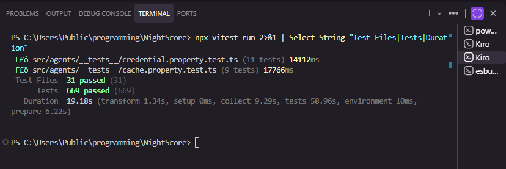

# NightScore

> Privacy-preserving credit scoring on Midnight — prove your creditworthiness without revealing your financial activity. Protected by NightGuard AI security.

## Live Demo
https://newmoon-entry-projects.vercel.app

## Contract Address
| Network | Address |
|---------|---------|
| Preview | a3e01772c31935fc25719d878514b2bb1b64198c65b4862dd9fcb6888173af71 |
| Preprod | [DEPLOYING — will update when Preprod sync completes] |

## What Is NightScore?

NightScore is a **privacy-preserving credit scoring + AI security platform** built on the Midnight blockchain. It combines three core capabilities:

1. **ZK Credit Scoring** — Computes a DeFi credit grade from 6 wallet signals using zero-knowledge proofs. Your financial data never leaves your device.
2. **NightGuard AI** — AI-powered transaction security screening that protects your wallet before you sign. Detects phishing, scam contracts, unlimited approvals, and behavioral anomalies.
3. **Confidential Credentials** — Mint ZK credentials on Midnight that prove your creditworthiness without revealing anything about your wallet.

### The Problem
- In DeFi, there's no way to prove creditworthiness without exposing your entire wallet history
- Users sign malicious transactions because they can't assess risk before committing
- Traditional credit scores don't exist on-chain, and existing on-chain reputation exposes everything

### Our Solution
- **Score privately** — 6 wallet signals computed in a ZK circuit, graded by AI (Groq), credential minted on Midnight
- **Sign safely** — NightGuard AI (Fireworks AI) screens every transaction before signing, flagging risks in real-time
- **Prove without revealing** — Verifiers check "is this wallet BBB or above?" and get YES/NO, never seeing raw data

## Architecture

```
┌─────────────────────────────────────────────────────────┐
│                    NightScore System                      │
├─────────────────────────────────────────────────────────┤
│  9 Adaptive Agents communicating via Message Bus         │
│                                                          │
│  ┌──────────┐  ┌──────────┐  ┌──────────┐             │
│  │Orchestr- │  │  Wallet  │  │  Signal  │              │
│  │  ator    │  │  Agent   │  │  Agent   │              │
│  └────┬─────┘  └────┬─────┘  └────┬─────┘             │
│       │              │              │                    │
│  ┌────▼──────────────▼──────────────▼─────┐            │
│  │           MESSAGE BUS                    │            │
│  └────┬──────────────┬──────────────┬─────┘            │
│       │              │              │                    │
│  ┌────▼─────┐  ┌────▼─────┐  ┌────▼─────┐            │
│  │ Scoring  │  │Credential│  │  Guard   │  ← NEW      │
│  │  (Groq)  │  │  (Mint)  │  │(Fireworks│              │
│  └──────────┘  └──────────┘  └──────────┘             │
│                                                          │
│  ┌──────────┐  ┌──────────┐  ┌──────────┐             │
│  │  Cache   │  │ Monitor  │  │Verificat-│              │
│  │(Supabase)│  │ (Metrics)│  │   ion    │              │
│  └──────────┘  └──────────┘  └──────────┘             │
└─────────────────────────────────────────────────────────┘
```

| Agent | Responsibility | AI Provider |
|-------|---------------|-------------|
| Orchestrator | Pipeline coordination | — |
| Wallet | Lace wallet connection | — |
| Signal | Read wallet signals from ZK Witness | — |
| Scoring | Credit grade computation | Groq (Llama 3.3 70B) |
| Credential | Mint/revoke ZK credentials | — |
| Verification | Threshold queries (boolean only) | — |
| Cache | Supabase request cache | — |
| Monitor | Metrics, alerting, health | — |
| **Guard** | **Transaction security screening** | **Fireworks AI** |

## Privacy Model
- **PUBLIC** (on-chain): Score hash, wallet registered flag, total scored counter, threshold boolean
- **PRIVATE** (never on-chain): Wallet age, TX frequency, DeFi interactions, repayment history, asset diversity, liquidation history, actual score
- **PROVED without revealing**: "My credit grade meets your minimum threshold" → true/false

## NightGuard — AI Security

NightGuard screens transactions before you sign them:

| Check | What It Detects |
|-------|----------------|
| Contract Age | Contracts deployed < 7 days ago |
| Unlimited Approvals | Token approvals with no spending limit |
| Phishing | Typosquatting, suspicious URLs, known scam addresses |
| Behavioral Anomaly | Interactions with unknown contracts |
| High Value | Transactions > 3x your average |
| Score Impact | How signing might affect your NightScore |

**AI Model**: Fireworks AI (Llama 3.1 8B Instruct) — fast inference, structured JSON output

## Credit Grades

| Grade | Score Range | Meaning |
|-------|-------------|---------|
| AAA | 85-100 | Exceptional — minimal risk |
| AA | 70-84 | Very good — low risk |
| A | 55-69 | Good — moderate risk |
| BBB | 40-54 | Adequate — acceptable risk |
| BB | 25-39 | Below average — elevated risk |
| C | 0-24 | Poor — high risk |

## Tech Stack

| Layer | Technology |
|-------|-----------|
| Blockchain | Midnight (Compact language, ZK circuits) |
| Wallet | Lace (Midnight DApp Connector) |
| Credit AI | Groq API (Llama 3.3 70B) |
| Security AI | Fireworks AI (Llama 3.1 8B Instruct) |
| Backend | TypeScript, Node.js 22+ |
| Frontend | React 18, Vite, Tailwind CSS, Framer Motion |
| Animations | Lottie (custom crypto animations) |
| Testing | Vitest + fast-check (669 tests) |
| Cache/Config | Supabase |
| Deployment | Vercel (frontend), GitHub Actions (CI/CD) |

## Prerequisites
- Node.js v22+
- Lace wallet browser extension
- Docker (for proof server, local development)

## Setup & Run
```bash
git clone https://github.com/Shibo326/Newmoon-Entry.git
cd Newmoon-Entry
npm install

# Create .env with your keys
cp .env.example .env

# Run tests (669 tests)
npm test

# Run frontend
cd frontend
npm install
npm run dev
```

## Environment Variables
```bash
FIREWORKS_API_KEY=    # Fireworks AI (NightGuard)
GROQ_API_KEY=        # Groq (Scoring Agent)
SUPABASE_URL=        # Supabase (Cache)
SUPABASE_ANON_KEY=   # Supabase (Auth)
```

## Tests
```bash
npm test
```
669 tests across 31 suites: agent logic, property-based tests, circuit verification, privacy guarantees, integration tests.

## Demo Video
https://drive.google.com/drive/folders/1XGSac_jwkefbDrzCCsG440uhtcgLShX1?usp=sharing

## Product Proposal
See PROPOSAL.md — NightScore implements **Confidential Credentials** + **AI-Powered Security**: prove credit credentials are valid without disclosing data, while AI guards protect every transaction.

## Screenshots
### Test Output (669 tests passing)


### Compile Output


### Contract Deployed


## License
MIT
