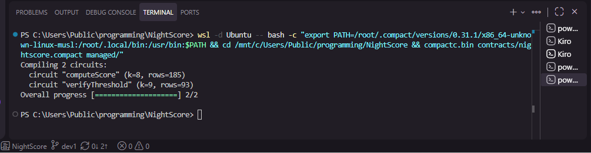
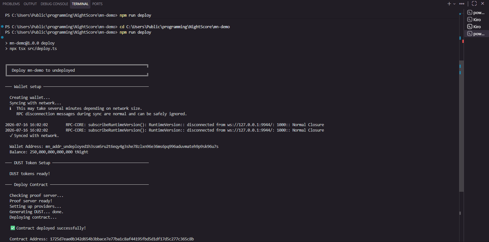

# NightScore

> Privacy-preserving credit scoring on Midnight — prove your creditworthiness without revealing your financial activity.

## Contract Address

| Network  | Address                          |
|----------|----------------------------------|
| Preview  | a3e01772c31935fc25719d878514b2bb1b64198c65b4862dd9fcb6888173af71 |
| Preprod  | [PASTE ADDRESS AFTER DEPLOY]     |

## What This Does

NightScore computes a DeFi credit grade from 6 wallet signals (wallet age, transaction frequency, DeFi interactions, repayment history, asset diversity, liquidation history) using zero-knowledge proofs on Midnight. The user's raw financial data never leaves their device — only a hash of their score and a boolean threshold proof go on-chain.

A lending protocol can verify "does this wallet have at least a BBB credit grade?" and get a yes/no answer without ever seeing the actual grade or the underlying signals.

## Privacy Model

- **What is PUBLIC** (on-chain, visible to anyone):
  - `scoreHash` — a hash proving a credit score was computed
  - `walletRegistered` — boolean flag that a wallet has been scored
  - `totalScored` — counter of total wallets scored

- **What is PRIVATE** (private witness, never on-chain):
  - Wallet age (days)
  - Transaction frequency
  - DeFi protocol interactions
  - Repayment success rate
  - Asset diversity (distinct token types)
  - Liquidation history

- **What the user PROVES without revealing**:
  - "My credit grade meets your minimum threshold" (boolean only)
  - The verifier sees true/false — never the actual grade or raw signals

## Tech Stack

- Midnight network
- Compact language (ZK smart contracts)
- Node.js v22
- Docker (proof server)
- Vitest (testing)
- TypeScript

## Prerequisites

- Node.js v22+
- Docker Desktop (for proof server)
- WSL (if on Windows — Compact compiler is Linux/Mac only)
- Compact compiler: `curl --proto '=https' --tlsv1.2 -LsSf https://github.com/midnightntwrk/compact/releases/latest/download/compact-installer.sh | sh`

## Setup

```bash
# Clone the repo
git clone https://github.com/Shibo326/Newmoon-Entry.git
cd Newmoon-Entry
git checkout dev1

# Install dependencies
npm install

# Install Compact compiler (Linux/Mac/WSL)
curl --proto '=https' --tlsv1.2 -LsSf https://github.com/midnightntwrk/compact/releases/latest/download/compact-installer.sh | sh
source ~/.bashrc

# Start the proof server
docker run -p 6300:6300 midnightntwrk/proof-server:latest midnight-proof-server -v

# Compile the contract
compact compile

# Deploy to Preview
NODE_OPTIONS="--max-old-space-size=12288" npm run deploy -- --network preview
```

## Run Tests

```bash
npm test
```

## Screenshots

### Compile Output


### Contract Deployed


## Initial Idea

NightScore is a privacy-preserving credit reputation layer for DeFi lending protocols on Midnight. Users build a credit score from their on-chain activity (wallet age, transaction frequency, DeFi interactions, repayment history, asset diversity, and liquidation events), then prove their creditworthiness to lenders via zero-knowledge threshold proofs — without revealing their actual score, wallet history, or financial behavior. A lending protocol asks "does this borrower have at least a BBB credit grade?" and gets a cryptographic yes/no — never the raw data. This enables under-collateralized lending while protecting user privacy.

## File Structure

```
NightScore/
├── contracts/
│   └── nightscore.compact       ← Compact contract (ZK circuits)
├── managed/                      ← Auto-generated by compact compile
├── src/                          ← Agent architecture + screenshots
│   ├── agents/                   ← 8 specialized agents
│   ├── bus/                      ← Message bus
│   ├── registry/                 ← Agent registry
│   ├── compile-output.png        ← Screenshot: compile output
│   └── contract-deployed.png     ← Screenshot: deployed contract
├── tests/
│   └── nightscore.test.ts       ← Contract test suite
├── .github/
│   └── workflows/               ← CI/CD (Level 3)
├── README.md
└── package.json
```

## Live Demo

[PASTE LIVE URL AFTER DEPLOYING FRONTEND]

## Frontend

The NightScore frontend is a React + Vite + TypeScript single-page application with a dark theme and glassmorphism UI. It demonstrates the ZK credit scoring flow with a mock provider (replace with real Midnight SDK when available).

```bash
cd frontend
npm install
npm run dev
```

Build for production:
```bash
cd frontend
npm run build
```

Deploy to Vercel:
```bash
cd frontend
npx vercel
```

## Privacy Claim

An on-chain observer can see the disclosed weighted score but CANNOT see the 6 raw wallet signals (walletAge, txFrequency, defiInteractions, repaymentHistory, assetDiversity, liquidationHistory). The user proves their creditworthiness via ZK proof without revealing any private data.

## License

MIT
